# KPI Automation Platform — Cloud Deployment on AWS

A production-style, highly-available deployment of an internal **KPI report-automation tool** on AWS. The platform ingests telecom KPI data (CSV), runs a heavy Excel/data-processing pipeline asynchronously, stores results, and exposes the whole flow through a web app behind an Application Load Balancer.

> **Honest scope note.** This is a **personal recreation** of a single internal module I worked on during my DevOps internship at **Jio Platforms Limited**. The original production system lived inside Jio's own network and infrastructure, which I cannot reproduce or disclose. To demonstrate the part I actually built and owned, I re-implemented and **redeployed that module end-to-end from my own AWS account** — same application logic, same deployment patterns, rebuilt on standard AWS primitives. Components that were Jio-internal (custom domain, Route 53, WAF, org-level networking) are intentionally **not** part of this recreation.

---

## 1. Project Overview

The KPI Automation Platform automates the generation of **Pre/Post KPI comparison reports** from raw telecom CSV exports. A user uploads a CSV through the web UI; the system queues a job, processes the data against an Excel template, and returns a downloadable report — without the user waiting on a synchronous request.

The interesting part of this project is **not** the application — it's the **deployment**. The original tool was a set of Windows servers wired together with a shared `Z:\` drive, hardcoded VM IPs, encrypted credential files, and an Excel-COM (`xlwings`) processing engine. This project re-architects that into a **cloud-native, multi-AZ, auto-scaling, queue-decoupled system** on AWS, with a full **Jenkins CI/CD pipeline** that ships immutable artifacts to both tiers.

| | |
|---|---|
| **Domain** | Telecom KPI reporting / internal tooling |
| **Scale** | Internal tool (~200 users) — built for **resilience and zero-downtime deploys**, not high traffic |
| **Region** | `ap-south-1` (Mumbai), across **2 Availability Zones** |
| **Pattern** | Three-tier (web → app → data) + async worker tier decoupled via SQS |
| **Compute** | Dockerized Flask backend + bare-Python worker fleet, both in Auto Scaling Groups |
| **Deploy model** | Immutable artifacts — ECR image (backend) and baked AMI (worker), rolled out via Instance Refresh |

### Impact at a Glance

What re-architecting the legacy module onto AWS actually changed. 

| Dimension | Before — legacy module | After — this deployment |
|---|---|---|
| **Availability** | Single automation server — a single point of failure | 2-AZ Auto Scaling fleet (min 2); survives instance **and** AZ loss |
| **Deployment** | Manual, multi-step, per-server patching | One `git push` → fully automated; **rollback = 1 config change** |
| **Job durability** | In-flight job lost if the server crashed | **Zero job loss** — SQS re-delivers; DLQ isolates repeat failures after 3 tries |
| **Duplicate work** | N/A (one server) | **Exactly one** result per job, enforced by SQS visibility timeout (chaos-tested) |
| **Worker concurrency** | ~5 jobs on one box | Up to **ASG-max (4) × `MAX_CONCURRENT_JOBS` (5) ≈ 20** concurrent jobs, auto-scaled |
| **Secrets** | Encrypted files + decrypt key on disk | **Zero stored credentials** — Secrets Manager fetched via IAM role at boot |

---

## 2. Architecture Diagram


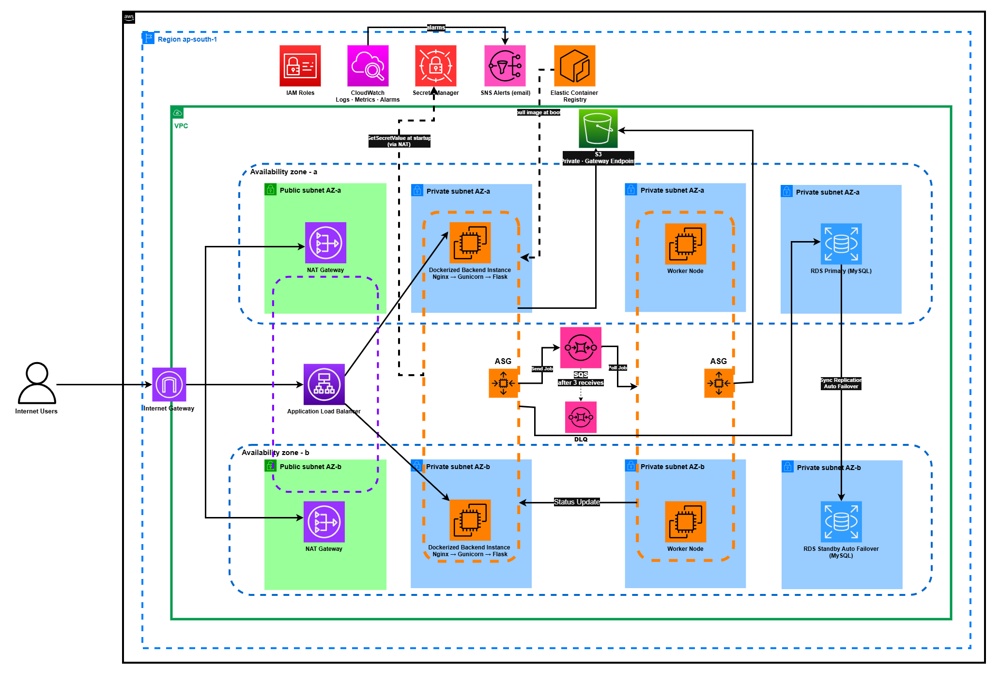


---

## 3. CI/CD Deployment Workflow

CI/CD is built around one principle: **never modify a running instance.** Each deploy produces an immutable, versioned artifact and *replaces* instances with it. This makes configuration drift structurally impossible — any instance the ASG launches later (scale-out, health replacement, AZ rebalance) comes up on the exact same artifact.


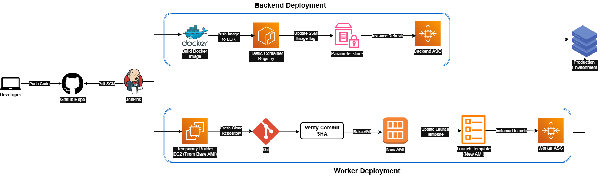


The two tiers ship **different artifact types** but use the **same rollout mechanism**:

| Tier | Artifact | How Jenkins ships it | Rollback |
|---|---|---|---|
| **Backend** (Docker) | ECR image `kpi-backend:<sha>` | build once → push → bump SSM tag → Instance Refresh | `put-parameter` an old SHA + refresh |
| **Worker** (bare Python) | baked AMI `kpi-automation-ami-<sha>` | launch builder → fresh clone → bake AMI → relink Launch Template → Instance Refresh | point LT at an older AMI + refresh |

The pipeline ([`Jenkinsfile`](Jenkinsfile)) is split into **discrete, named stages** so a failure pinpoints exactly which step broke, and the build scripts live in [`ci/`](ci/) (one script per stage) rather than inlined in Groovy.

## Jenkins Build

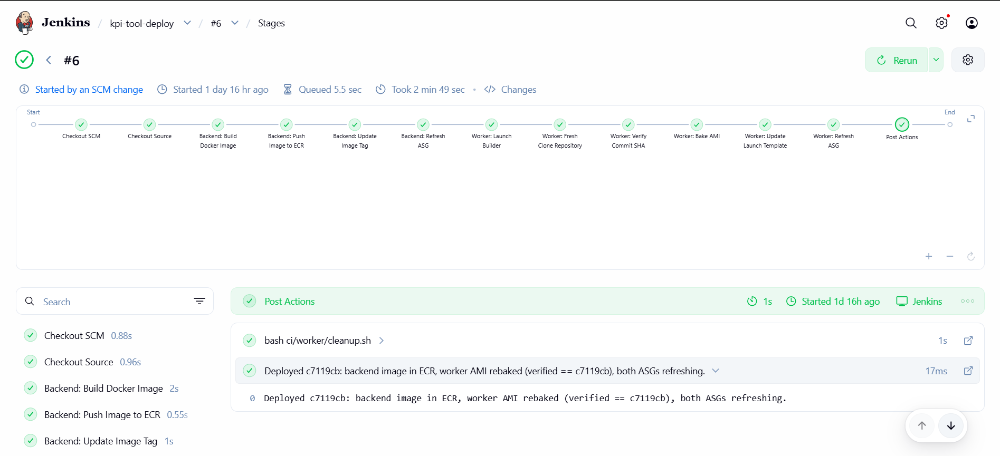

---

## 4. Worker AMI Rebuild Pipeline Workflow

The worker is **not** containerized (it's a long-running systemd service), so its deploy artifact is a **freshly baked AMI** rather than a container image. Jenkins automates the entire rebake — scripts in [`ci/worker/`](ci/worker/):

```
1. launch-builder.sh        → run a private EC2 builder FROM the last-good worker AMI
                              (id read from SSM /kpi/automation/ami-id)
2. provision.sh             → via SSM RunCommand: git fetch + reset --hard origin/main,
                              reinstall deps, restart the worker service
3. verify.sh                → assert the builder's HEAD == the commit being deployed
                              (deploy aborts if the git update didn't take)
4. bake.sh                  → ec2 create-image  →  kpi-automation-ami-<sha>
5. update-launch-template.sh→ new LT version pointing at the new AMI + set as default
                              + write the new AMI id back to SSM Parameter Store
6. refresh-asg.sh           → ASG Instance Refresh rolls the worker fleet onto the new AMI
post/always: cleanup.sh     → terminate the temporary builder instance
```

---

## 5. Key Features

- **Highly available across 2 AZs** — every tier (ALB, backend, worker, RDS) spans `ap-south-1a` and `ap-south-1b`, with one NAT Gateway per AZ.
- **Asynchronous, decoupled processing** — the backend enqueues jobs to **SQS** and returns immediately; a separate worker fleet long-polls and processes them.
- **Self-healing, auto-scaling compute** — both the backend and the worker run as **Auto Scaling Groups**; dead instances are replaced automatically.
- **Exactly-once-ish job semantics** — SQS visibility timeout guarantees a job is processed by only one worker; failed-infra jobs retry and eventually land in a **Dead-Letter Queue**.
- **Immutable, drift-free deployments** — every deploy produces a versioned artifact tied to the git SHA (ECR image for backend, baked AMI for worker), rolled out via **Instance Refresh**.
- **Zero stored credentials** — servers authenticate via **IAM roles**; DB/app secrets come from **Secrets Manager** at startup; no SSH keys (**SSM Session Manager** for shell access).
- **Full observability** — Nginx, Gunicorn, worker, and RDS logs ship to **CloudWatch**; CloudWatch Alarms publish to **SNS** email on 5xx spikes, unhealthy hosts, DLQ activity, queue backlog, and RDS pressure.
- **One-push CI/CD** — a `git push` to `main` triggers Jenkins, which deploys both tiers with no manual steps and structurally impossible configuration drift.

---

## 6. AWS Services Used

| Service | Purpose in this project |
|---|---|
| **VPC** (2 public + 6 private subnets, IGW, 2× NAT GW, route tables) | Isolated network; app/data tiers in private subnets, only the ALB and NAT are public-facing. |
| **Application Load Balancer (ALB)** | Public HTTP front door; spreads traffic across backend instances in both AZs and health-checks them. |
| **EC2 + Auto Scaling Groups (ASG)** | Two independent self-healing fleets — Dockerized backend and the SQS-consuming worker — each min 2 across 2 AZs. |
| **Launch Templates** | Define how the ASG launches instances (AMI, instance type, SG, IAM profile, user-data) — versioned for each deploy. |
| **Amazon RDS for MySQL (Multi-AZ)** | Managed database with a synchronous standby in the second AZ and automatic failover. |
| **Amazon SQS** (`kpi-jobs`) | Decouples the backend from the workers; lets the worker tier scale horizontally with no duplicate processing. |
| **SQS Dead-Letter Queue** (`kpi-jobs-dlq`) | Captures jobs that fail their infra retries (maxReceives = 3) so they stop retrying forever and can be inspected. |
| **Amazon S3** (+ VPC **Gateway Endpoint**) | Object storage replacing the old `Z:\` share — inputs, outputs, templates, config. Reached privately (no NAT cost). |
| **Amazon ECR** | Private registry holding the versioned backend Docker image (`kpi-backend:<sha>`). |
| **AWS Secrets Manager** | Stores DB credentials and the Flask secret key; fetched by the backend at startup via its IAM role. |
| **IAM Roles** | Per-tier least-privilege permissions (backend, worker, Jenkins) — no access keys stored on any server. |
| **AWS Systems Manager (SSM)** | Session Manager (keyless shell into private instances), Parameter Store (image tag / base AMI id), and RunCommand (drives the worker AMI rebake). |
| **Amazon CloudWatch** | Centralized logs (Nginx, Gunicorn, worker, RDS), metrics, and alarms. |
| **Amazon SNS** | Email alerts fired by CloudWatch Alarms. |
| **Jenkins** (on EC2) | CI/CD orchestrator — builds, versions, and rolls out both tiers on every push to `main`. |

---

## 7. System Architecture Explanation

The platform is a **three-tier design with an added asynchronous worker tier**, all inside a single VPC (`10.0.0.0/16`) spanning two AZs.

**Network layout**

| Subnet tier | AZ-a | AZ-b | Contents |
|---|---|---|---|
| Public | `10.0.1.0/24` | `10.0.2.0/24` | ALB, NAT Gateways, Jenkins |
| Private — backend | `10.0.3.0/24` | `10.0.4.0/24` | Backend ASG instances |
| Private — worker | `10.0.5.0/24` | `10.0.6.0/24` | Worker ASG instances |
| Private — data | `10.0.7.0/24` | `10.0.8.0/24` | RDS primary + standby |

**Security-group chaining** enforces tier isolation — each tier only accepts traffic from the tier directly in front of it:

- `sg-alb` ← `0.0.0.0/0:80`
- `sg-backend` ← `sg-alb:80`
- `sg-rds` ← `sg-backend:3306`
- `sg-automation` ← **no inbound rules at all** (the worker only makes outbound calls — it pulls from SQS, writes S3, and posts status back via the ALB)

**Why SQS sits between the tiers.** The backend never calls the worker directly. It drops a `job_id` onto SQS and returns. The worker fleet pulls from that queue, and because SQS hides a message the instant one worker receives it (visibility timeout), the same job can never be picked up twice. That single property is what lets the **worker tier run as an Auto Scaling Group** — "scaling" just means "more pollers on the same queue."

**Data & secrets.** Application files live in S3, reached privately through a VPC Gateway Endpoint (so S3 traffic never touches — or is billed by — the NAT). DB and Flask secrets live in Secrets Manager and are fetched at boot using the instance's IAM role, so nothing sensitive is baked into images or env files.

---

## 8. Request / Job Processing Flow

```
Internet user
  → Internet Gateway
  → Application Load Balancer        (public subnets, AZ-a + AZ-b)
  → Backend EC2  (Nginx → Gunicorn → Flask, private subnets, ASG)
       1. stores kpi_input.csv + meta.json in S3   (inputs/<job_id>/)
       2. inserts a 'Queued' row in RDS MySQL
       3. SendMessage { job_id } → SQS  (kpi-jobs)   ──┐  returns immediately
                                                       ▼
  → Worker EC2   (SQS long-poll consumer, private subnets, own ASG)
       4. ReceiveMessage from SQS
       5. reads meta.json + template from S3
       6. runs the Excel/data pipeline (openpyxl)
       7. writes the result zip to S3   (outputs/<job_id>/)
       8. POSTs job status back to the backend via the ALB
       9. DeleteMessage  (ack) → job done
  → RDS MySQL    (Primary AZ-a, synchronous Standby AZ-b)
```

---

## 9. Repository Structure

```
KPI-Automation-Tool/
├── Jenkinsfile                       # CI/CD pipeline — staged backend + worker deploys
├── ci/                               # one shell script per pipeline stage
│   ├── backend/                      # build-image, push-image, update-image-tag, refresh-asg
│   ├── worker/                       # launch-builder, provision, verify, bake,
│   │                                 #   update-launch-template, refresh-asg, cleanup
│   ├── lib/                          # shared config (worker-config.sh)
│   └── rebake-worker-ami.sh          # standalone end-to-end worker-rebake script
│
├── kpi-automation-backend/           # Flask web app + API (the "backend" tier)
│   ├── IMS_backend.py                # main Flask app: auth, KPI routes, S3/SQS/RDS calls
│   ├── Dockerfile                    # Nginx → Gunicorn → Flask image (pushed to ECR)
│   ├── requirements.txt
│   ├── s3_helpers.py                 # S3 get/put helpers (replaces the old Z:\ drive)
│   ├── db_connect/                   # MySQL handler (now reads creds from Secrets Manager)
│   ├── templates/  static/           # web UI
│   └── local/                        # AWS build + deployment guides (this project's docs)
│
└── kpi-automation-worker/            # async job processor (the "worker" tier)
    └── prepost/
        ├── prepost_api.py            # SQS long-poll consumer (was a Flask job-runner)
        ├── prepost_runner.py         # per-job orchestration
        ├── Final_run.py              # Excel/data processing engine (openpyxl)
        ├── requirements-automation.txt
        └── VERSION


```

---

## 10. Deployment Evidence

> _Screenshots from the live deployment in my AWS account._


### VPC + Subnets Across 2 Availability Zones

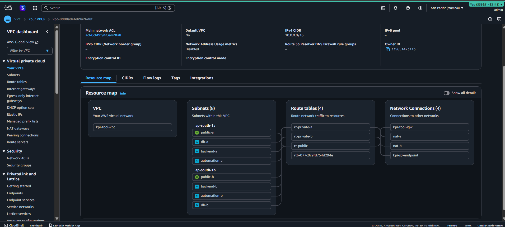

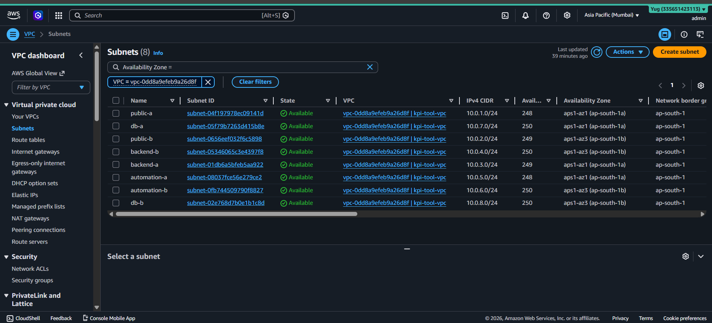

---

### Application Load Balancer with Healthy Targets

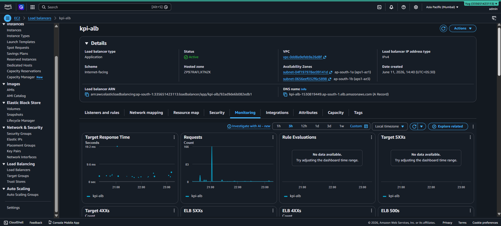

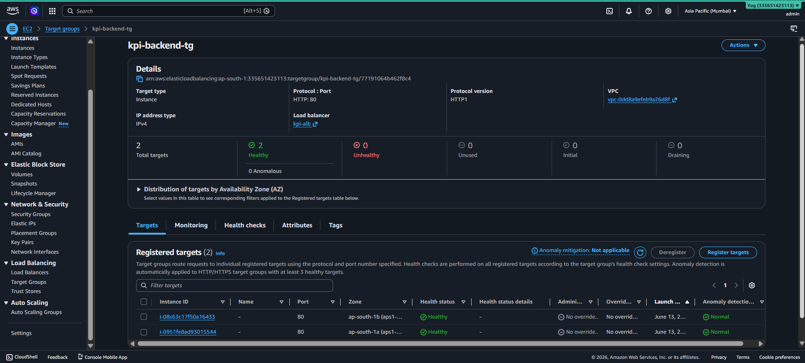

---

### Backend Auto Scaling Group

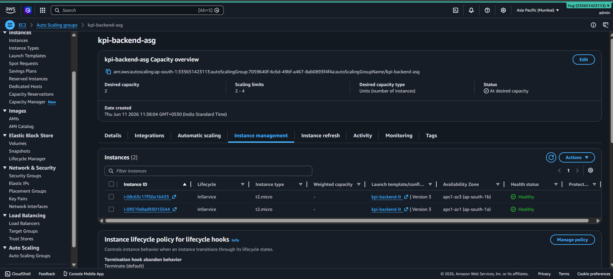

---

### Worker Auto Scaling Group

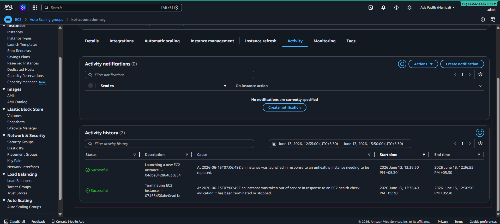

---

### RDS MySQL Multi-AZ Deployment

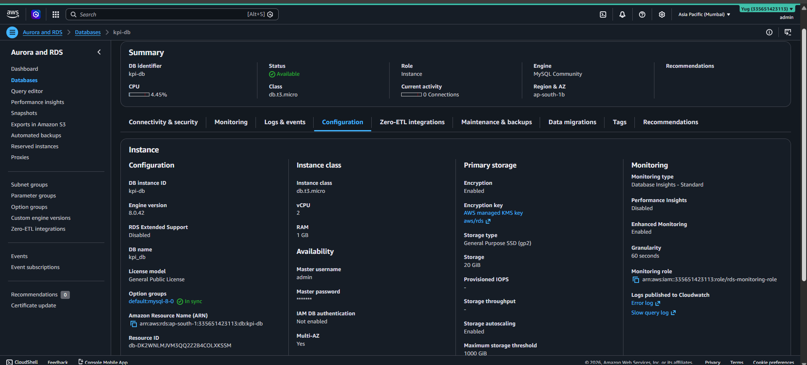

---

### SQS Queue and Dead-Letter Queue

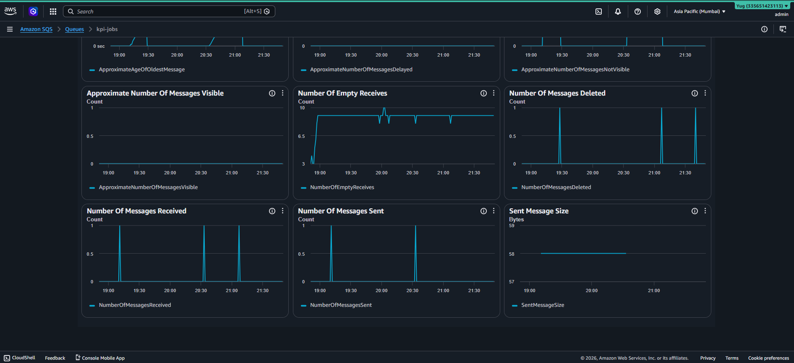

---

### ECR Repository with SHA-Tagged Images

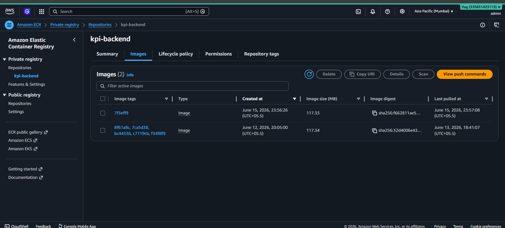

---

### CloudWatch Logs and Alarms

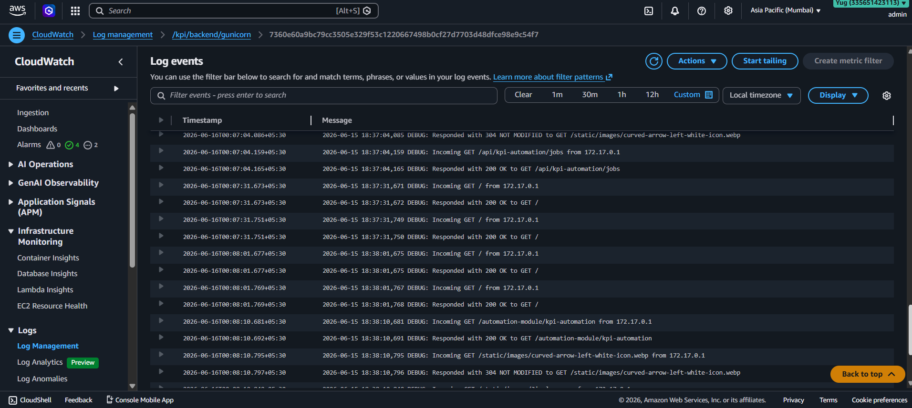

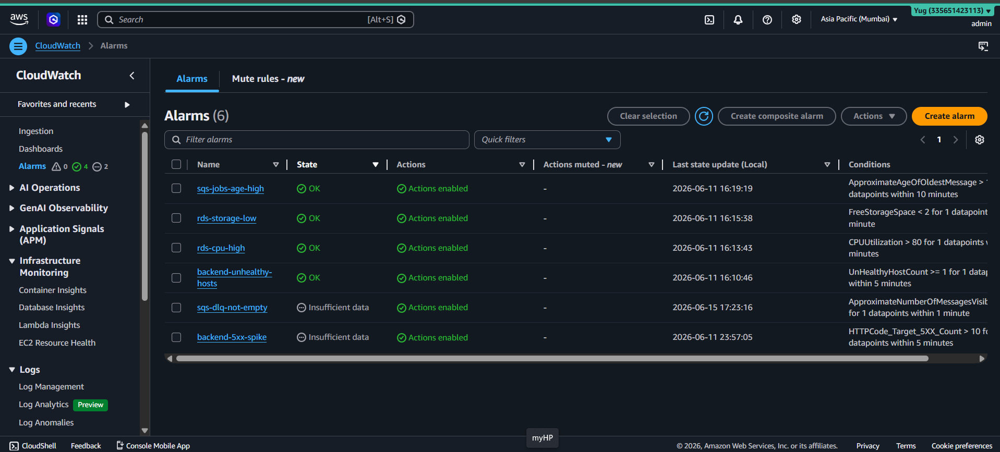

### S3 Storage

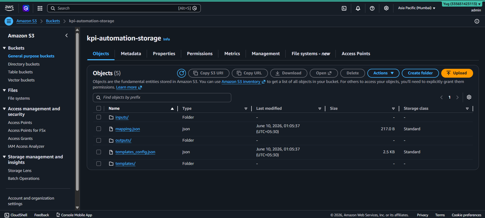

---

## 11. Engineering Challenges Solved

| Challenge | Solution |
|---|---|
| **Windows-only Excel engine** (`xlwings` needs MS Excel + COM, won't run on Linux EC2) | Ported the processing logic to **`openpyxl`** so it runs on headless Amazon Linux. |
| **Shared `Z:\` network drive** as the data layer | Replaced with **S3** + a VPC Gateway Endpoint; all file I/O goes through `s3_helpers.py`. |
| **Hardcoded VM IPs** for server-to-server calls | Backend → worker call replaced with **SQS**; status callbacks go through the **ALB DNS** via env var. |
| **Encrypted credential files** (`.enc` + `secret.key`) checked into servers | Replaced with **Secrets Manager** fetched at startup through the instance IAM role. |
| **Single automation server** = a bottleneck and a single point of failure | Decoupled via SQS so the worker could become a **multi-AZ Auto Scaling Group** with no double-processing. |
| **Configuration drift** — patching live instances left the AMI stale, so scale-out booted old code | Moved to **immutable artifacts** (ECR image + baked AMI) tied to the git SHA, rolled out via **Instance Refresh**. |
| **Worker isn't containerized** but still needs drift-free deploys | Built an automated **AMI rebake pipeline** (launch builder → provision via SSM → verify SHA → bake → relink LT → refresh). |

---

## 12. Security & Reliability Features

**Security**

- **No long-lived credentials anywhere** — every server uses an **IAM role**; secrets come from **Secrets Manager** at runtime.
- **No SSH / no public IPs** on app or data tiers — shell access is via **SSM Session Manager**; private subnets only egress through NAT.
- **Tiered security groups** — each tier accepts traffic only from the one in front of it; the worker has **zero** inbound rules.
- **Private S3 access** via Gateway Endpoint; **RDS not publicly accessible**; **Block Public Access** on the bucket.

**Reliability**

- **Multi-AZ everywhere** — ALB, both ASGs, and RDS (synchronous standby + automatic failover) span two AZs.
- **Self-healing** — ASGs replace failed instances; the ALB drains unhealthy targets.
- **No job loss** — SQS re-delivery + DLQ ensure in-flight jobs survive a worker crash.
- **Zero-downtime, reversible deploys** — Instance Refresh with a min-healthy-percentage; rollback is a parameter/LT change away.
- **Proactive alerting** — CloudWatch Alarms → SNS email on 5xx spikes, unhealthy hosts, **DLQ not empty**, queue backlog/age, and RDS CPU/storage.

---

## 13. Architecture Decisions & Trade-offs

Every choice below was deliberate and has a cost. Listing the trade-offs is the point — there is no free lunch, and being explicit about what I gave up is more honest (and more useful in an interview) than claiming each decision was strictly optimal.

| Decision | Why I chose it | Trade-off I accepted | Alternatives considered |
|---|---|---|---|
| **SQS between backend & worker** | Decouples the tiers so the worker can scale to a fleet with no double-processing; absorbs bursts; survives worker crashes. | Adds eventual-consistency (status isn't instant) and an extra service to operate/monitor. | Direct HTTP call (original design — couples tiers, SPOF); Celery + Redis broker (more moving parts, another HA component to run). |
| **Multi-AZ + ASG for a ~200-user tool** | Resilience and zero-downtime deploys were the actual requirement; HA was a baseline standard, not a scale need. | **Deliberately over-provisioned for the traffic** — costs more than a single box would. | Single EC2 + manual restart (cheaper, but a SPOF with downtime on every deploy). |
| **S3 Gateway Endpoint** | S3 traffic stays on the AWS backbone — no NAT data-processing charges, lower latency, tighter security. | One more VPC construct to manage and attach to route tables. | Route S3 through the NAT (simpler, but pays per-GB and widens the egress path). |
| **Secrets Manager for DB/app secrets** | Native rotation support and clean IAM-scoped access for credentials. | Costs per secret/month vs. free SecureString params. | SSM Parameter Store SecureString (free, used here for non-secret config like image tags). |

---

*KPI Automation Platform · Three-tier + async worker · `ap-south-1` (Mumbai) · 2 AZs · Dockerized Flask backend (ECR) · SQS-decoupled worker ASG · Jenkins CI/CD · Secrets Manager + CloudWatch + SNS · Recreated from an internship module, redeployed from a personal AWS account.*